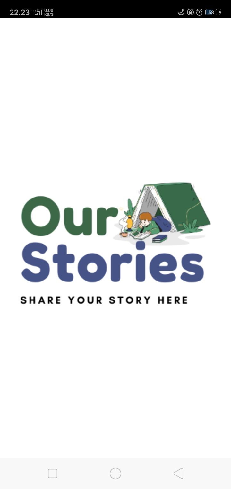
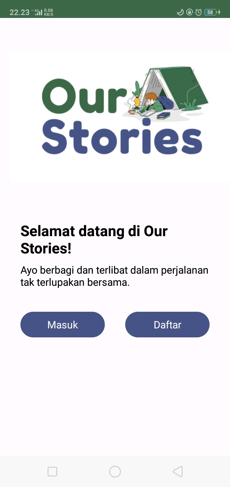
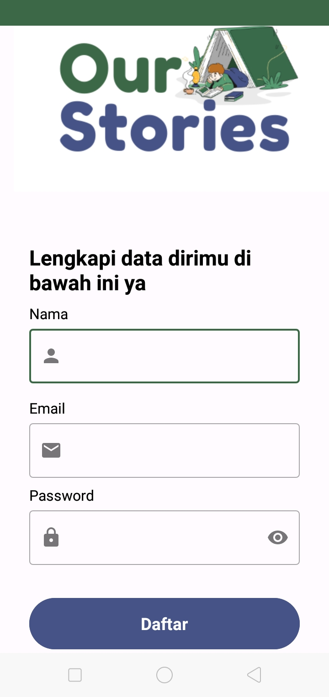
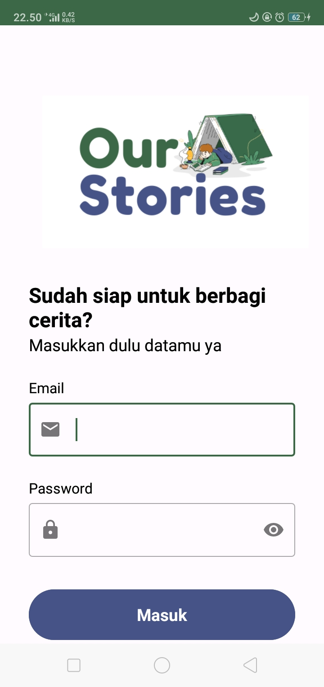
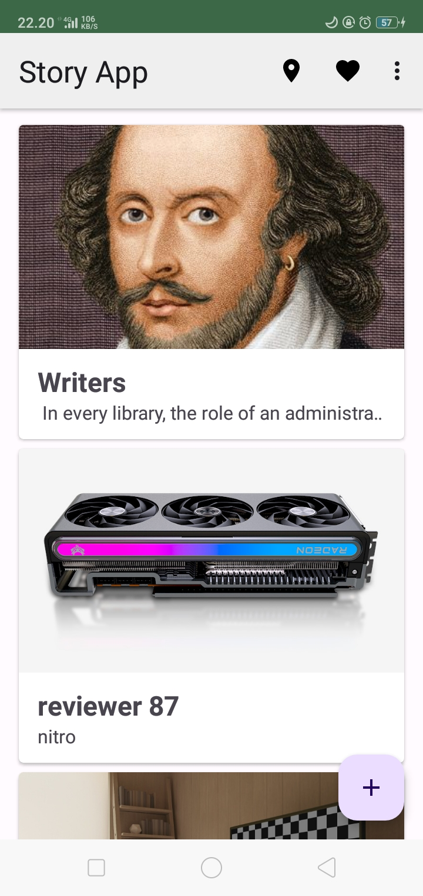
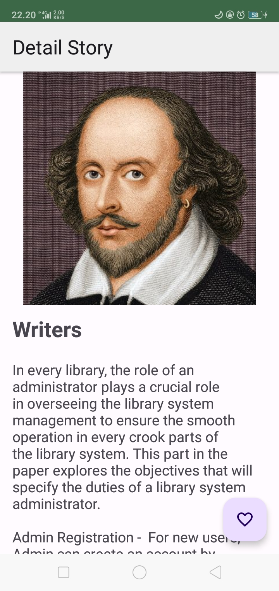
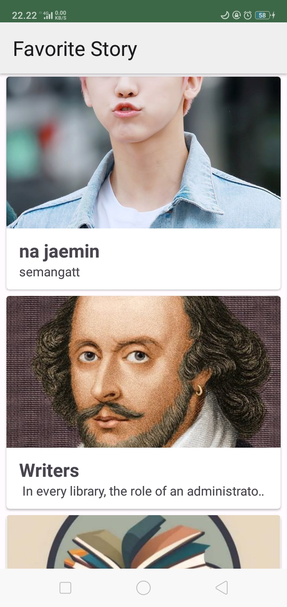
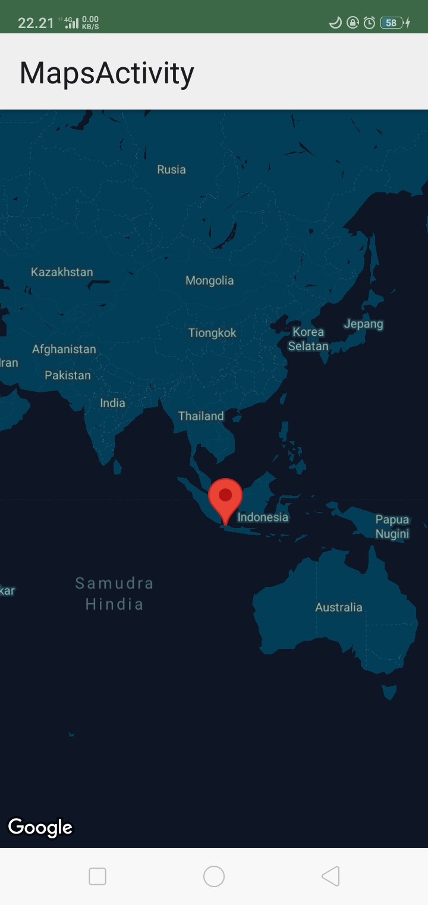
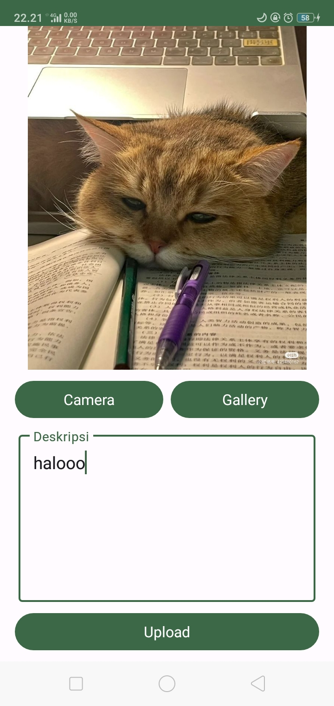

# StoryApp

This is repository for Submission Intermediate Android

|           Name              | Student ID  |        Path         |
| :-------------------------: | :---------: | :-----------------: |
|      Lutfi Nur Rohmah       | A015BSX2004 | Android Development |

# OurStory 

## Description
StoryApp is an immersive mobile application that invites users into a world of storytelling. The app features a seamless login and registration process to access its exciting range of features. Users can explore the latest stories uploaded by fellow users, providing a platform for a diverse range of narratives.

## Key Features
- Login and Register: Secure your access to StoryApp by creating an account or logging in. A personalized experience awaits you.

- Discover Latest Stories: Explore a collection of the most recent stories shared by the vibrant StoryApp community. From personal anecdotes to creative tales, there's something for everyone.

- View and Favorite Stories: Dive into the details of other users' stories and add your favorites to your personal collection.

- Upload Your Story: Unleash your creativity by sharing your own stories with the community. Whether it's a personal experience or a work of fiction, let your narrative shine.

- Explore Story Locations: Experience stories in a unique way by discovering the locations associated with them. See where users were inspired to create their captivating tales.

## Screenshoots
|   |   |   |
| --------------------------------------------------- | --------------------------------------------------- | --------------------------------------------------- |
|   |   |   |
|   |   |   |
